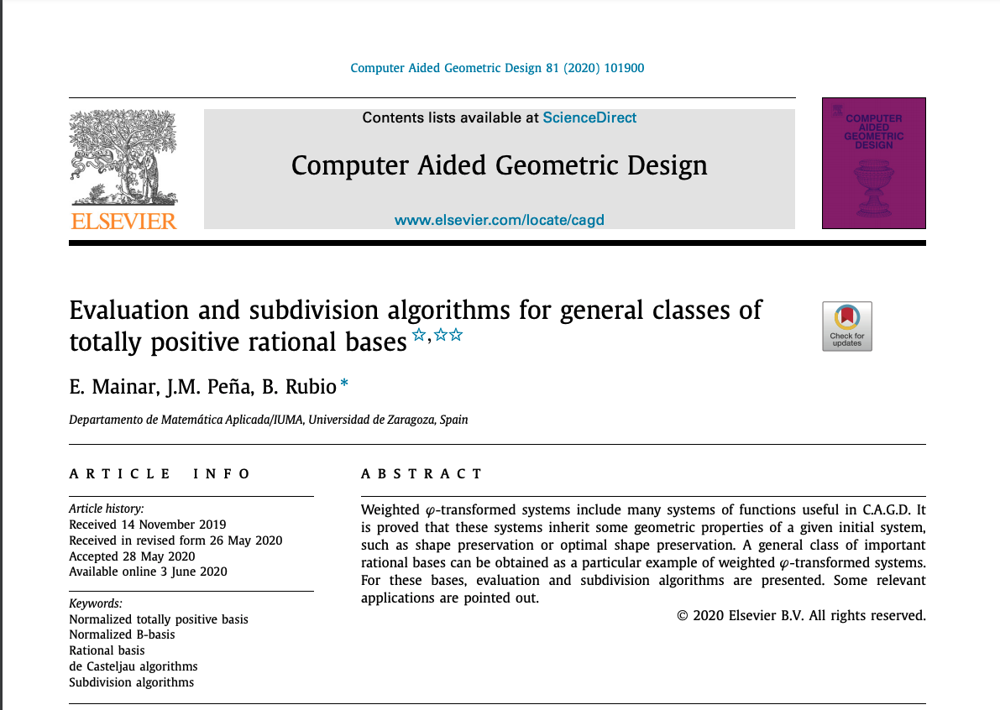

# Evaluation and subdivision algorithms for general classes of rational bases

In this repository, two applications of Matlab are provided. 

1. In [App_evaluation_subdivision_general](https://github.com/BeatrizRubio/Article_CAGD_2020/tree/main/App_evaluation_subdivision) the Matlab application which draw an algorithm of evaluation and subidvision of a general class of rational bases is provided.
2. In [App_evaluation_subdivision](https://github.com/BeatriazRubio/Article_CAGD_2020/App_evaluation_subdivision) the application which draw an algorithm of evaluation and subidvision of a particular class of rational bases which generate nested rational spaces is provided.

This application can be very useful when we want to compare the curves generated by the different rational bases proposed.

The implementation uses Matlab 2020b.

